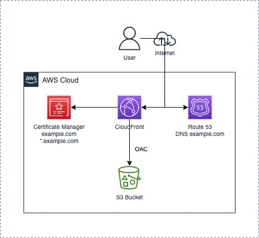

# Static Website Infrastructure

The following architecture is created via this script:



## Configuration

Initializing the Terraform scripts, within the `static-website` folder:
```bash
terraform init
```

The script requires the following variables:
- `aws_profile`: AWS CLI profile to use, should have enough permissions to create all resources.
- `aws_region`: Region in which the resources will be created.
- `tag_app`: App name to be used as a tag in all resources.
- `app_url`: Expected app url, i.e, `example.com`.
- `aws_hosted_zone_id`: Hosted Zone ID for an existing Hosted Zone in Route 53.

All Terraform commands should be run with the variable declarations:
```bash
-var="aws_profile=AWS_PROFILE" -var="aws_region=AWS_REGION" -var="tag_app=example.com" -var="app_url=example.com" -var="aws_hosted_zone_id=ZONE_ID"
```

## Permissions

The following IAM policy should offer all the required permissions to plan, apply, and destroy the infrastructure:
```json
{
    "Version": "2012-10-17",
    "Statement": [
        {
            "Effect": "Allow",
            "Sid": "PlanAndApplyInfra",
            "Action": [
                "acm:RequestCertificate",
                "cloudfront:CreateOriginAccessControl2020_05_31",
                "s3:ListBucket",
                "cloudfront:GetOriginAccessControl2020_05_31",
                "s3:CreateBucket",
                "s3:GetBucketTagging",
                "s3:PutBucketTagging",
                "acm:DescribeCertificate",
                "s3:GetBucketPolicy",
                "s3:GetBucketAcl",
                "s3:GetBucketCORS",
                "s3:GetBucketWebsite",
                "s3:GetBucketVersioning",
                "s3:GetAccelerateConfiguration",
                "s3:GetBucketRequestPayment",
                "s3:GetBucketLogging",
                "s3:GetLifecycleConfiguration",
                "s3:GetReplicationConfiguration",
                "s3:GetEncryptionConfiguration",
                "s3:GetBucketObjectLockConfiguration",
                "s3:PutBucketPublicAccessBlock",
                "s3:GetBucketPublicAccessBlock",
                "acm:ListTagsForCertificate",
                "cloudfront:CreateDistributionWithTags2020_05_31",
                "route53:GetHostedZone",
                "route53:ChangeResourceRecordSets",
                "route53:GetChange",
                "route53:ListResourceRecordSets",
                "cloudfront:GetDistribution2020_05_31",
                "cloudfront:ListTagsForResource2020_05_31",
                "s3:PutBucketPolicy"
            ],
            "Resource": "*"
        },
        {
            "Effect": "Allow",
            "Sid": "DestroyInfra",
            "Action": [
                "acm:DescribeCertificate",
                "cloudfront:GetOriginAccessControl2020_05_31",
                "s3:ListBucket",
                "acm:ListTagsForCertificate",
                "s3:GetBucketPolicy",
                "s3:GetBucketAcl",
                "s3:GetBucketCORS",
                "s3:GetBucketWebsite",
                "route53:GetHostedZone",
                "s3:GetBucketVersioning",
                "s3:GetAccelerateConfiguration",
                "route53:ListResourceRecordSets",
                "s3:GetBucketRequestPayment",
                "s3:GetBucketLogging",
                "s3:GetLifecycleConfiguration",
                "s3:GetReplicationConfiguration",
                "s3:GetEncryptionConfiguration",
                "s3:GetBucketObjectLockConfiguration",
                "s3:GetBucketTagging",
                "s3:GetBucketPublicAccessBlock",
                "cloudfront:GetDistribution2020_05_31",
                "cloudfront:ListTagsForResource2020_05_31",
                "s3:PutBucketPublicAccessBlock",
                "s3:DeleteBucketPolicy",
                "route53:ChangeResourceRecordSets",
                "route53:GetChange",
                "cloudfront:DeleteDistribution2020_05_31",
                "cloudfront:UpdateDistribution2020_05_31",
                "cloudfront:DeleteOriginAccessControl2020_05_31",
                "acm:DeleteCertificate",
                "s3:DeleteBucket"
            ],
            "Resource": "*"
        }

    ]
}
```

Many of the permissions could be duplicated, but that's because during the teardown process, Terraform performs checks and requires those permissions for the checks.

## Resources

The following general resources are created:
- **S3 Bucket**: Bucket that would hold all the website files. Includes:
  - Origin Access Control policy to allow access only from the CloudFront distribution.
  - Other configurations.
- **CloudFront Distribution**: Distribution that serves the website. Includes:
  - SSL certificate from ACM.
  - Origin Access Control policy.
- **ACM Certificate**: New SSL certificate, DNS-validated, for the given domain. 
- **Route 53 DNS Records**: Records for resolution of the domain name and verification of the SSL certificate.